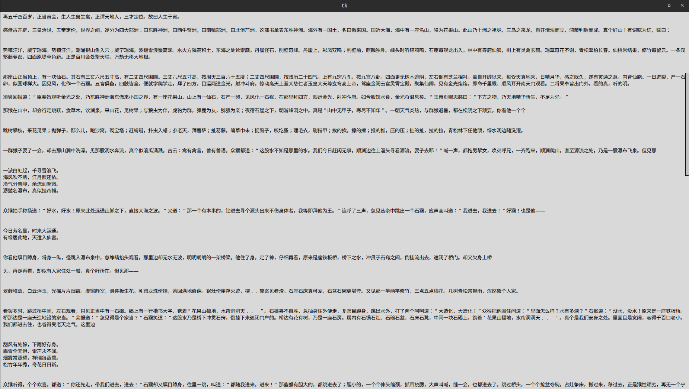

# SimpleBrowserEngine

A lightweight web browser implementation designed to demonstrate core browser functionalities and custom rendering techniques.

## Usage

```bash
python3 source.py <https://your-site.tld>
```
## Result
