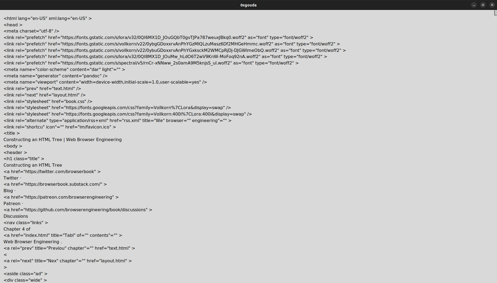

# SimpleBrowserEngine

A lightweight web browser implementation designed to demonstrate core browser functionalities and custom rendering techniques.

## Usage

``````bash
python3 source.py
    -h or --help: show help menu
    usage: python3 source.py http[s]://example.org
           python3 source.py file://path/to/your/file 
           python3 source.py data:text/html,"gouda 3mk"
           python3 source.py view-source:[any-scheme]://example.org 
``````
## Result

